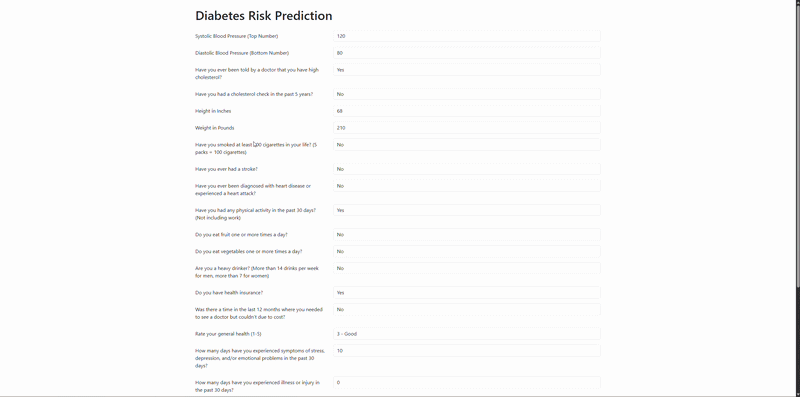
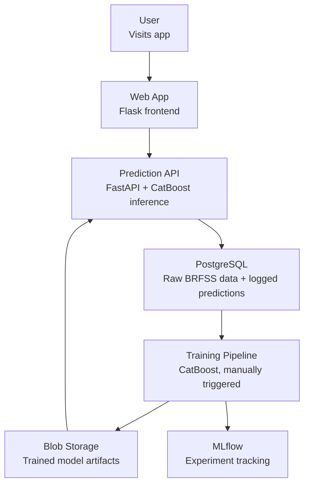

# Diabetes Risk Prediction

End-to-end diabetes risk prediction with a production-style architecture and SHAP-powered explainability.

## Live Demo



[Try it live](jackmasin.com/diabetes-risk-pred)

> **Note**: The first visit may take 30-60 seconds to load because min replicas is set to 0 on Azure Container Apps to reduce hosting costs on a portfolio project. In production, at least one warm replica would be maintained.

## Project Overview

This project predicts diabetes risk from self-reported health survey data, giving users an early signal without a clinical test. Beyond the model itself, it's built as a full ML pipeline: data flows from ingestion through training, experiment tracking, and deployment, ending in a live API and web app that explains each prediction using SHAP. The goal was to demonstrate the kind of end-to-end ML engineering practices a production system requires, not just a standalone model.

## Architecture



Splitting the system into three independent services means each can be modified, scaled, and given access to only the Azure credentials it needs, without affecting the others.

**Web App**

- Flask frontend
- Takes user input and creates JSON payload for FastAPI.
- Renders model prediction and SHAP values.

**Prediction API**

- FastAPI backend
- Preprocesses JSON payload so data can be used by the CatBoost models.
- Loads model artifacts from Blob Storage.
- Predicts diabetes risk and returns prediction and SHAP values to frontend.

**Training Pipeline**

- Manually-triggered GitHub Actions training pipeline.
- Ingests data from PostgreSQL database and creates training and testing datasets.
- Splits data before preprocessing to prevent data leakage, so preprocessing steps like scaling are fit only on training data.
- Preprocesses raw BRFSS data in training and testing datasets.
- Trains main diabetes prediction model and auxiliary cholesterol prediction model.
- Logs experiment metrics and parameters to MLflow via Azure ML.
- Uploads model artifacts to Blob Storage.

**Data Layer**

- Two PostgreSQL tables
  - Health indicators table with raw BRFSS health indicators.
  - Prediction logging table (with the inputs that produced them) designed so that, in a real healthcare setting, true patient outcomes could later be joined against past predictions to monitor model drift and support retraining.

**Azure Infrastructure**

- Key Vault to store database and blob storage secrets.
- Blob storage to store model artifacts.
- Container Apps to host the application.
- Azure ML MLflow for experiment tracking.

## Data

The source of the data was the [BRFSS Health Indicators dataset](https://www.kaggle.com/datasets/alexteboul/diabetes-health-indicators-dataset). The dataset contains 21 features covering self-reported health conditions, lifestyle factors, and demographics. The target variable `Diabetes_012` indicates no diabetes, prediabetes, or diabetes.

<details>
<summary>Full feature dictionary</summary>

| Variable Name        | Type    | Description                                                                                                                                             | Key                                                                                                                                                                                                                                                                                           |
| -------------------- | ------- | ------------------------------------------------------------------------------------------------------------------------------------------------------- | --------------------------------------------------------------------------------------------------------------------------------------------------------------------------------------------------------------------------------------------------------------------------------------------- |
| Diabetes_012         | Integer | Presence of Diabetes or Prediabetes (target)                                                                                                            | 0 = no diabetes, 1 = prediabetes, 2 = diabetes                                                                                                                                                                                                                                                |
| HighBP               | Binary  | Does the patient have high blood pressure                                                                                                               | 0 = no high BP, 1 = high BP                                                                                                                                                                                                                                                                   |
| HighChol             | Binary  | Does the patient have high cholesterol                                                                                                                  | 0 = no high cholesterol, 1 = high cholesterol                                                                                                                                                                                                                                                 |
| CholCheck            | Binary  | Has the patient had a cholesterol check in the past 5 years                                                                                             | 0 = no, 1 = yes                                                                                                                                                                                                                                                                               |
| BMI                  | Integer | Body Mass Index                                                                                                                                         | N/A (continuous)                                                                                                                                                                                                                                                                              |
| Smoker               | Binary  | Has the patient smoked at least 100 cigarettes in their life (5 packs = 100 cigarettes)                                                                 | 0 = no, 1 = yes                                                                                                                                                                                                                                                                               |
| Stroke               | Binary  | Has the patient ever had a stroke                                                                                                                       | 0 = no, 1 = yes                                                                                                                                                                                                                                                                               |
| HeartDiseaseorAttack | Binary  | Does the patient have coronary heart disease (CHD) or have they experienced myocardial infarction (MI)                                                  | 0 = no, 1 = yes                                                                                                                                                                                                                                                                               |
| PhysActivity         | Binary  | Has the patient had any physical activity in the past 30 days - not including their job                                                                 | 0 = no, 1 = yes                                                                                                                                                                                                                                                                               |
| Fruits               | Binary  | Does the patient consume fruit one or more times a day                                                                                                  | 0 = no, 1 = yes                                                                                                                                                                                                                                                                               |
| Veggies              | Binary  | Does the patient consume vegetables one or more times a day                                                                                             | 0 = no, 1 = yes                                                                                                                                                                                                                                                                               |
| HvyAlcoholConsump    | Binary  | Is the patient a heavy drinker (>14 drinks per week for adult men and >7 drinks per week for adult women)                                               | 0 = no, 1 = yes                                                                                                                                                                                                                                                                               |
| AnyHealthcare        | Binary  | Does the patient have any kind of health care coverage, including health insurance, prepaid plans such as HMO, etc.                                     | 0 = no, 1 = yes                                                                                                                                                                                                                                                                               |
| NoDocbcCost          | Binary  | Was there a time in the past 12 months when the patient needed to see a doctor but could not because of cost                                            | 0 = no, 1 = yes                                                                                                                                                                                                                                                                               |
| GenHlth              | Integer | Patient's general health rating on a scale of 1-5                                                                                                       | 1 = excellent, 2 = very good, 3 = good, 4 = fair, 5 = poor                                                                                                                                                                                                                                    |
| MentHlth             | Integer | The number of days the patient experienced symptoms of stress, depression, and emotional problems in the past 30 days                                   | N/A (count, 0-30)                                                                                                                                                                                                                                                                             |
| PhysHlth             | Integer | The number of days the patient experienced illness or injury in the past 30 days                                                                        | N/A (count, 0-30)                                                                                                                                                                                                                                                                             |
| DiffWalk             | Binary  | Does the patient have serious difficulty walking or climbing stairs                                                                                     | 0 = no, 1 = yes                                                                                                                                                                                                                                                                               |
| Sex                  | Binary  | Patient's sex                                                                                                                                           | 0 = female, 1 = male                                                                                                                                                                                                                                                                          |
| Age                  | Integer | Patient's 13-level age category (See \_AGEG5YR in [CDC BRFSS 2015 Codebook Report](https://www.cdc.gov/brfss/annual_data/2015/pdf/codebook15_llcp.pdf)) | 1 = 18-24, 2 = 25-29, 3 = 30-34, 4 = 35-39, 5 = 40-44, 6 = 45-49, 7 = 50-54, 8 = 55-59, 9 = 60-64, 10 = 65-69, 11 = 70-74, 12 = 75-79, 13 = >80                                                                                                                                               |
| Education            | Integer | Patient's education level (See EDUCA in [CDC BRFSS 2015 Codebook Report](https://www.cdc.gov/brfss/annual_data/2015/pdf/codebook15_llcp.pdf))           | 1 = Never attended school or only kindergarten, 2 = Grades 1 through 8 (Elementary), 3 = Grades 9 through 11 (Some high school), 4 = Grade 12 or GED (High school graduate), 5 = College 1 year to 3 years (Some college or technical school), 6 = College 4 years or more (College graduate) |
| Income               | Integer | Patient's income level (See INCOME2 in [CDC BRFSS 2015 Codebook Report](https://www.cdc.gov/brfss/annual_data/2015/pdf/codebook15_llcp.pdf))            | 1 = Less than $10,000, 2 = $10,000 to less than $15,000, 3 = $15,000 to less than $20,000, 4 = $20,000 to less than $25,000, 5 = $25,000 to less than $35,000, 6 = $35,000 to less than $50,000, 7 = $50,000 to less than $75,000, 8 = $75,000 or more                                        |

</details>

A BMI Age interaction feature was engineered to reflect how older patients with high BMI are at greater risk of diabetes. Since there was high feature overlap between the prediabetes and diabetes class, they were combined into a single at-risk class for better model performance. As a result, the model performs binary classification rather than the original three-class problem. Additionally, since the dataset was imbalanced towards the no diabetes class, the training and testing splits were stratified to preserve the same class ratio in both. All training data was scaled using a StandardScaler, fit only on the training data only to avoid data leakage.

## Modeling

Four models were evaluated, those being Logistic Regression, XGBoost, CatBoost, and LightGBM. XGBoost, CatBoost, and LightGBM all had similar performance metrics after hyperparameter tuning and threshold optimization; however, CatBoost was selected for deployment due to its robustness, consistent probability behavior during threshold optimization, and reduced sensitivity to feature preprocessing. Given the performance convergence across the models, deployment reliability and operational stability were prioritized over marginal metric differences.

The final system has two CatBoost models, a primary diabetes prediction model and an auxiliary cholesterol prediction model. Since some users may have never had a cholesterol test, the auxiliary cholesterol prediction model was implemented to predict if the user has high cholesterol based on the other fields.

**Final Metrics**

| Metric    | Primary Diabetes Model | Auxiliary Cholesterol Model |
| --------- | ---------------------- | --------------------------- |
| Precision | 0.327                  | 0.592                       |
| Recall    | 0.805                  | 0.705                       |
| ROC-AUC   | 0.825                  | 0.735                       |

The primary model's threshold was optimized to favor recall over precision, reflecting a screening process where missing an at-risk patient is more costly than a false positive.

SHAP values are served alongside each prediction, giving the user a per-prediction explanation of which factors mattered most, rather than a static, global importance ranking.

Model parameters, metrics, and artifacts are logged to MLflow after each training pipeline run, making it possible to compare runs and roll back to a previous model version if a new one underperforms. Historical experiments from early notebook development were also backfilled via `etl/log_historical_experiments.py`, so the full modeling history is tracked in one place.

## Known Model Limitation

**Disclaimer:** Results given by the model should not be taken as clinical guidance.

Heavy alcohol use appears as risk-reducing in the model due to a spurious pattern in the BRFSS dataset. Diabetic respondents are commonly advised to reduce or stop drinking, so they skew toward non-heavy-drinkers in the survey, and the model learns this backwards correlation rather than a true protective effect. This discrepancy was discovered via SHAP inspection. See Future Improvements for potential mitigations.

## Tech Stack

- Language/Libraries: Python, pandas, scikit-learn, CatBoost/XGBoost/LightGBM, SHAP
- Backend/Frontend: FastAPI, Flask
- Data: PostgreSQL, SQLAlchemy
- MLOps: MLflow, Azure ML
- Cloud: Azure Container Apps, Azure Key Vault, Azure Blob Storage, Azure Container Registry, Docker
- CI/CD: GitHub Actions, Ruff

## CI/CD Pipeline

- `ci.yml`: Triggered on push. Runs tests and linting (Ruff), builds Docker images, pushes them to Azure Container Registry, and updates the FastAPI and Flask container apps.
- `train.yml`: Manually triggered. Builds a training image, pushes it to Azure Container Registry, runs the training job, and restarts the FastAPI container with the newly trained models.

## Repository Structure

```
diabetes-risk-pred/
├── .github/
│   └── workflows/        # CI/CD Pipelines
├── data/                 # Raw BRFSS data
├── etl/                  # Data loading and MLflow experiment logging
├── notebook/             # EDA and model development
├── sql/                  # Database and table creation scripts
├── src/
│   ├── api/              # API source code
│   ├── components/       # Reusable ML components
│   └── pipeline/         # ML pipelines
├── templates/            # Flask HTML templates
├── tests/                # Test suite
├── app.py                # Flask frontend entry point
├── docker-compose.yml    # Builds and runs all services plus a local PostgreSQL database
├── Dockerfile.api        # Prediction API container
├── Dockerfile.seed       # Populates local database when using docker-compose.yml
├── Dockerfile.train      # Training pipeline container
├── Dockerfile.web        # Web app container
└── requirements.txt      # Python dependencies
```

## Running Locally

> **Note:** This project runs entirely locally using a `.env` file for secrets and local model training. No Azure credentials are required.

**Prerequisites**

- Docker and Docker Compose
- Python 3.13 (if running anything outside containers, e.g., notebooks)

**1. Clone the repository**

- `git clone https://github.com/JJMasin11/diabetes-risk-pred`
- `cd diabetes-risk-pred`

**2. Environment Setup**

- Copy `.env.example` to `.env`
- The default values in `.env.example` work out of the box for local mode.

**3. Start the database**

- `docker compose up -d postgres`

**4. Load dataset**

- `docker compose run --rm seed`
- Only needs to be loaded one time.

**5. Train the models**

- `docker compose run --rm train`

**6. Start API and web app**

- `docker compose up -d`

**7. Open the app**

- Web UI: http://localhost:8080
- API docs: http://localhost:8000/docs

**Stopping the app**

- `docker compose down` to stop all services.

## Future Improvements

- Implement drift monitoring and outcome-based retraining using logged predictions and eventual ground truth outcomes. The database schema already supports this by storing the inputs behind each prediction; the evaluation and monitoring layer itself has not yet been built.
- Move from manually-triggered retraining to scheduled or drift-triggered retraining, rather than requiring a person to run the pipeline via GitHub Actions.
- Address the alcohol/reverse-causality limitation directly, for example by removing the feature or applying causal reweighting to correct for the spurious correlation.

## Contact

[LinkedIn](https://www.linkedin.com/in/jack-masin/)
